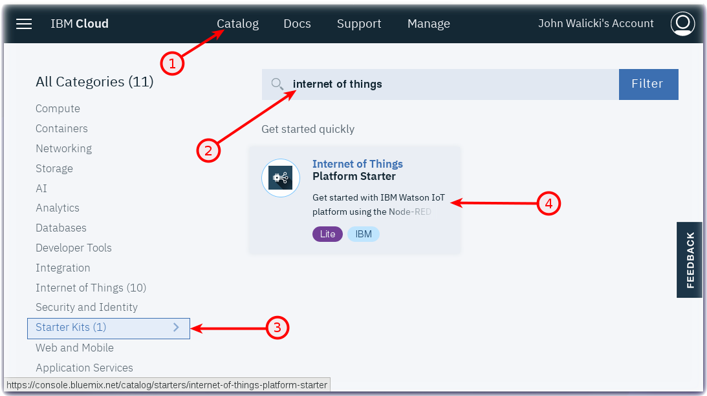
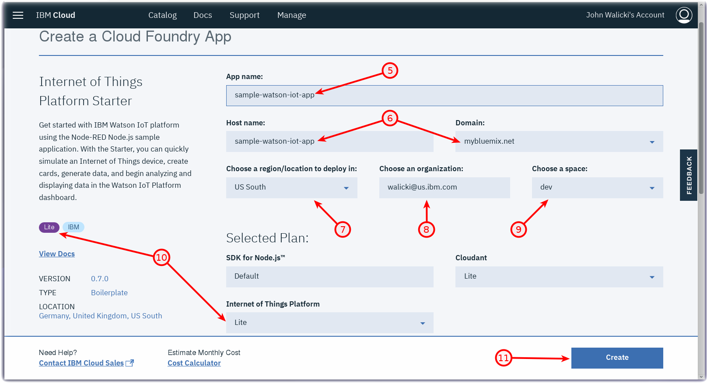
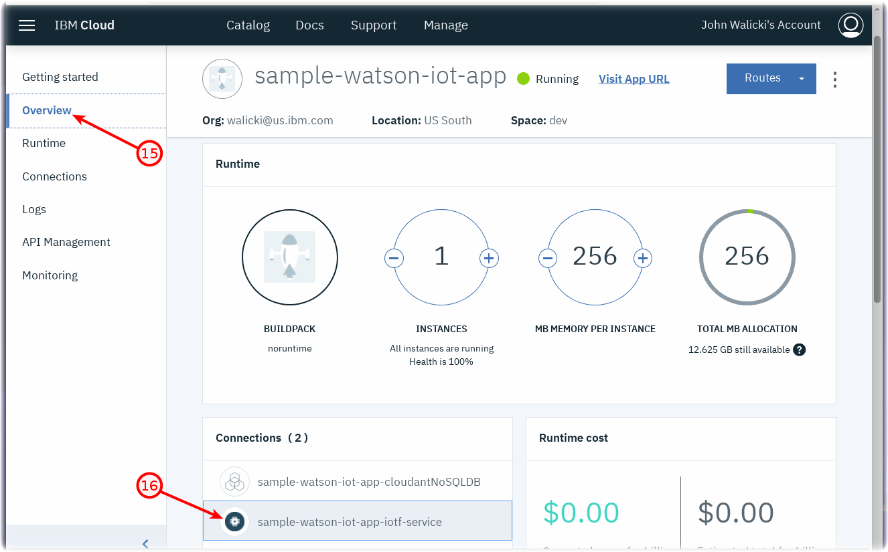
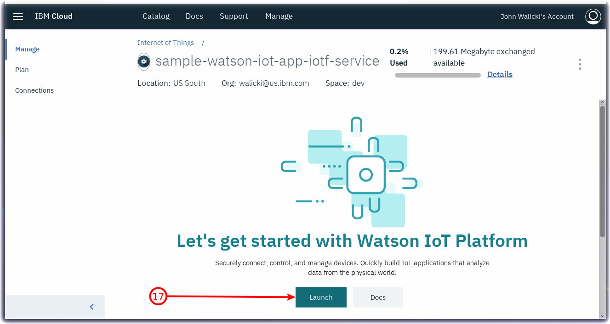
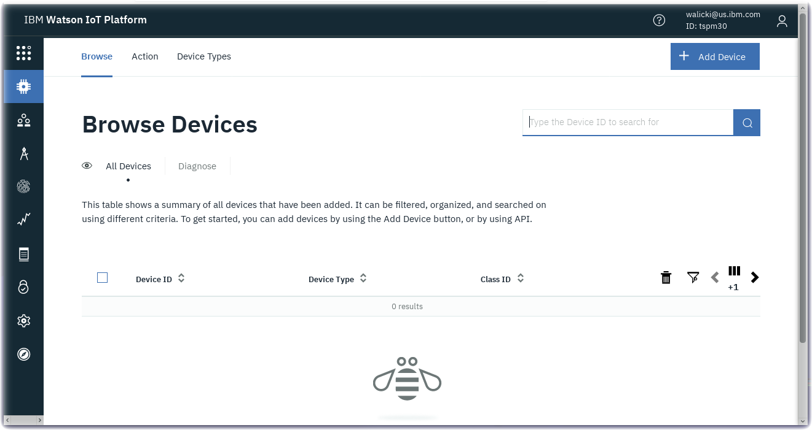

# Create an Internet of Things Platform Starter application
In this tutorial you will learn how to create a Watson IoT Platform Starter application that can be used to connect IoT devices and simulated IoT devices to the Watson IoT Platform. The **Internet of Things Platform Starter** is designed with pre-assembled services that work together.  The Internet of Things Platform Starter includes a Node-RED Node.js web server, Cloudant database to store the sensor data, and the IoT platform service so you can connect devices.

## Learning objectives

After completing this tutorial you will be able to:

* Create an IoT Starter Kit application running in IBM Cloud
* Launch the Watson IoT Starter application
* Open the Watson IoT Platform so that you can send data from IoT devices and device simulators

## Prerequisites
This tutorial can be completed using an IBM Cloud Lite account.

* Create an [IBM Cloud account](https://console.bluemix.net/registration)
* Log into [IBM Cloud](https://console.bluemix.net/login)

## Estimated time

You can complete this task in no more than 20 minutes.

## Step 1 - Create a Watson IoT Starter Application

Follow these steps to create a Watson IoT Platform Starter application in IBM Cloud.

* Create an [IBM Cloud account](https://console.bluemix.net/registration) and log into [IBM Cloud](https://console.bluemix.net/login)
* Click on the [Catalog](https://console.bluemix.net/catalog/?search=internet%20of%20things%20platform%20starte) (1) and search for **internet of things** (2)
* Under	**Starter Kits** (3) click on **Internet of Things Platform Starter** (4)

* Enter a **unique name** for your application (5). For example, *stmicro-discoverykit-yourname*. This name will be part of the **application URL** (6)
  * *Note:* In case the name is not unique you will receive an error message and can enter another name.
* The **Region** (7), **Organization** (8) and **Space** (9) will be prepopulated with valid options for your IBM Cloud account.  If you have a Lite account then accept the defaults.  If you have a trial or paid account, or belong to additional organizations, then you may choose to deploy in to any region, organization and space available to you.
* The IoT Starter application can be provisioned in the IBM Cloud *Lite* plan (10)
* Click on the **Create** button (11)

## Step 2 - Launch the IoT Starter Application

The Internet of Things Starter application will be provisioned in the IBM Cloud region that was specified. This is called staging an application. It can take a few minutes for this process to complete.

* Wait for the application to provision and start (12)
  * *Note:*  While you wait, you can click on the Logs tab and review the activity logs from the platform and Node.js runtime.
    * Click on **Logs** (13) in the left navigation menu.
    * Scroll to the bottom to check the latest DevOps messages.

  

## Step 3 - Launch the Watson IoT platform

Return to the IBM Cloud Application Details page.
* Click on the **Overview** item (14) in the left navigation menu.
* Click on your *iotf-service* (15) in the **Connections** tile.

* The **Internet of Things** service landing page will open. Click on the **Launch** (16) button.

* The **Watson IoT Platform** service will open in a new browser tab and you can create an IoT device.

## Finished
Congratulations.  You have completed the creation of a Watson Internet of Things Platform Starter application in IBM Cloud.
