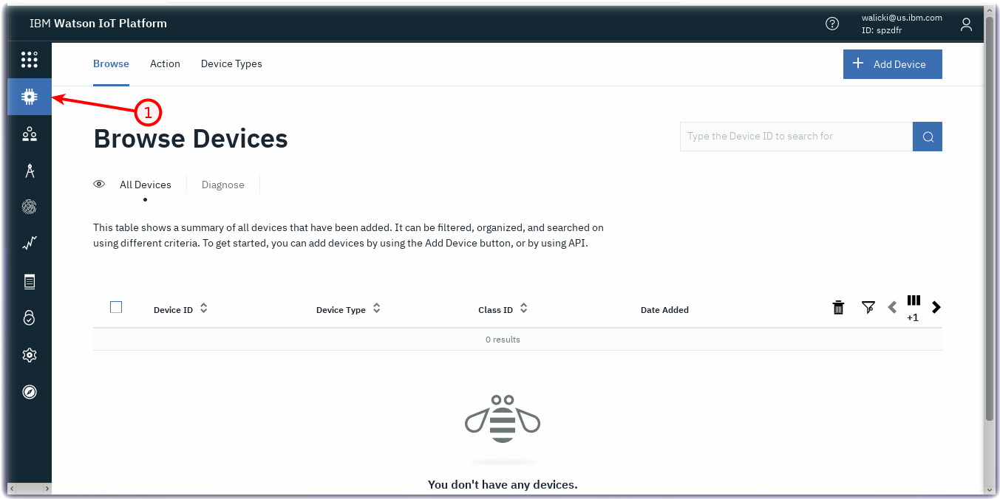
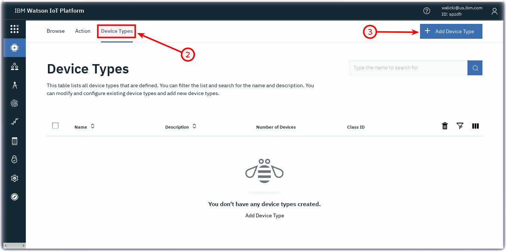
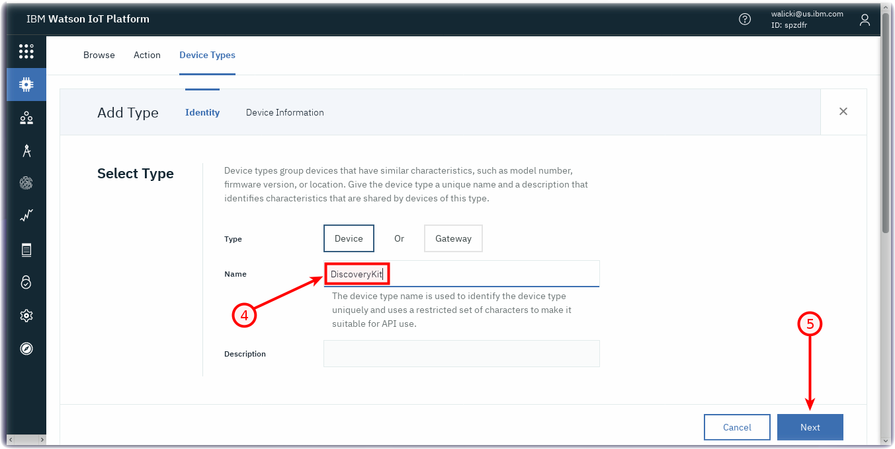
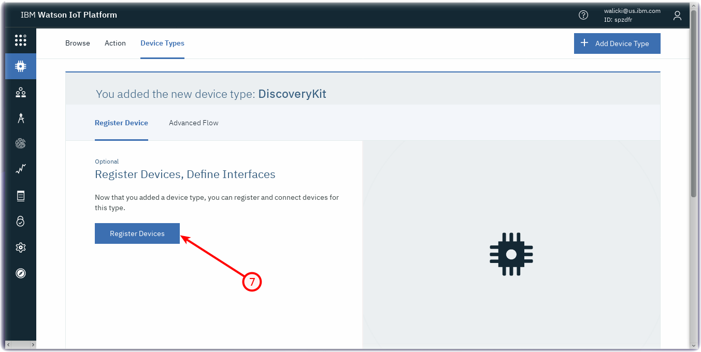
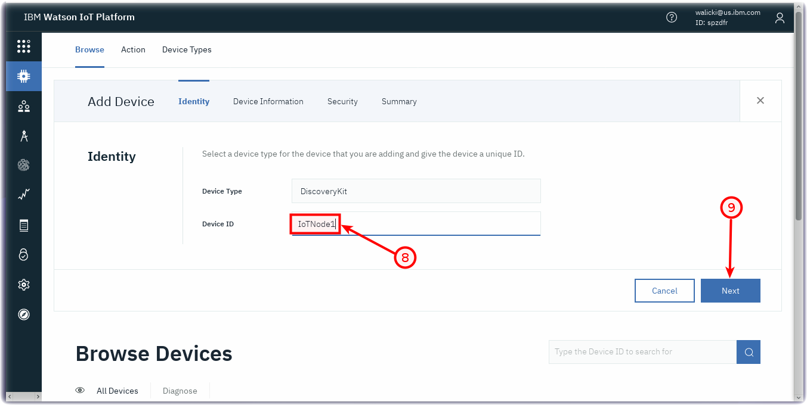
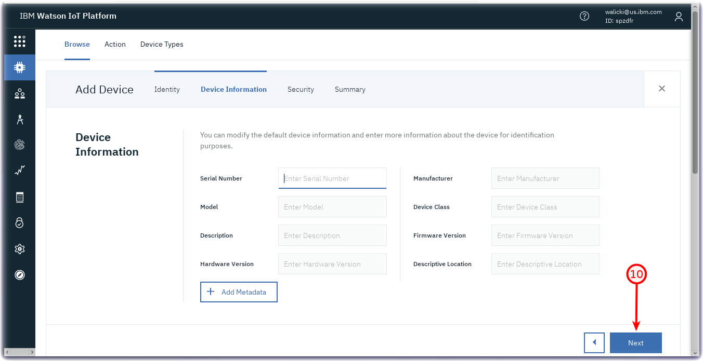
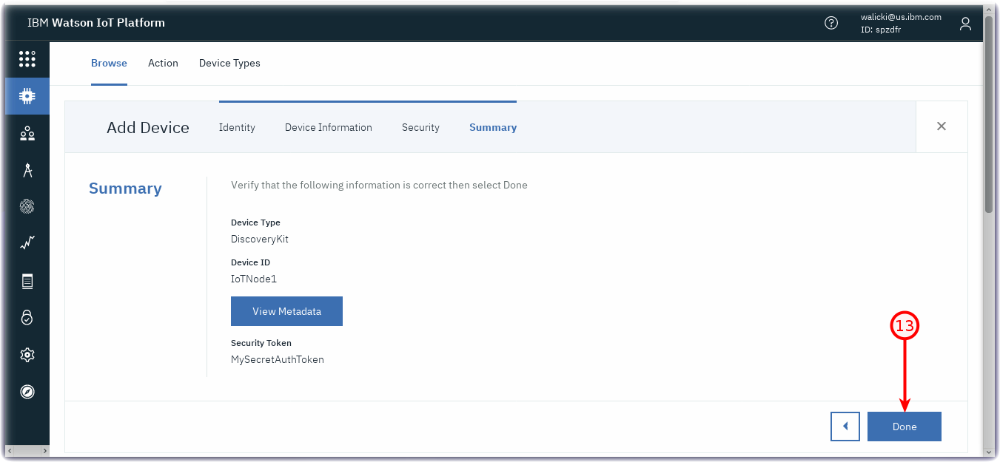
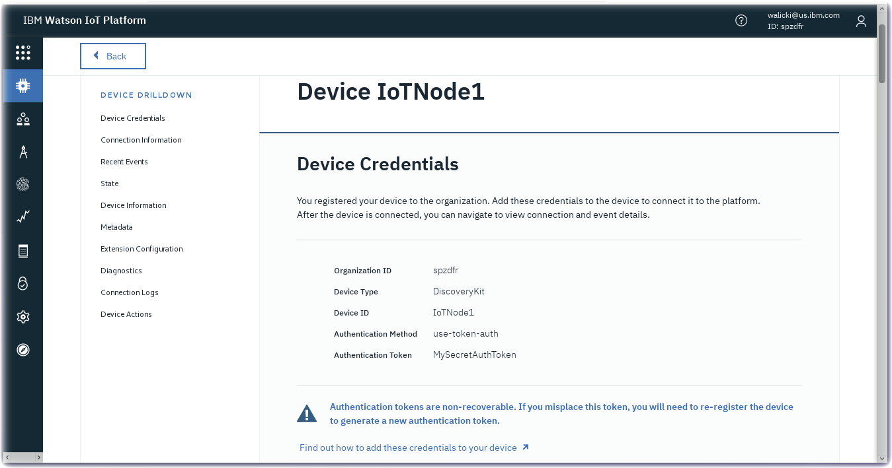

***
*Quick links :*
[Home](README.md) - [IoT Platform Starter](CREATEIOTP.md) - [Device Types and Devices](DISCOVERYDEVICE.md) - [Node-RED Setup](NODERED.md) - [Sensor Data](DISCOVERYIOTDATA.md) - [Node-RED Charts](DASHBOARD.md) - [Store Data in Cloud Storage](CLOUDANT.md) - [Historical Charts](HISTORY.md) - [Watson Studio](STUDIO.md) - [Jupyter Notebooks](JUPYTER.md)
***

# Registering a new device to the Watson IoT Platform

## Lab Objectives

This Lab will show you how to register your ST Micro Discovery Kit IoT Node with the IBM Watson Internet of Things Platform.  In the lab you will learn:

- How to define a device type and register a device in the Watson IoT Platform

### Introduction

Before you can connect a device to the Watson IoT Platform you need to define how the device will connect to the platform and also register the device to generate an access token for the device.  This will be used to verify the device identity.

You need to decide how you want to group devices, by function, by hardware type, etc.  Each device registered on the platform must be registered against a device type.  There are no restrictions about how devices are grouped and the device types, for this workshop we will create a device type representing the ST Microelectronics Discovery Kit IoT Node devices.

### Step 1 - Add a new device type for Discovery Kit IoT Node device

- Navigate into the Devices section (1) of the console


- Select the **Device Types** section (2).  Press the **+ Add Device Type** (3) button


- Enter the following:
  - Type : Ensure **Device** is selected (NOT Gateway)
  - Name : Enter **DiscoveryKit** (4)
- Press the **Next** button (5)


- Press the **Done** button (6)


### Step 2 - Register a new Discovery Kit device in the IoT Platform

You now have the opportunity to register a device.
- Press **Register Device** (7)


- The DiscoveryKit device type should be pre-selected.  You now need to enter a unique device ID.  You can choose how you want to identify devices.  For the workshop, use a simple format, such as **IoTNode1**. (8)
- Press **Next** button (9)


- Press **Next** button (10)

- You will be prompted to provide a token (11).

- Each time you connect the device the token will need to be presented to the server. Once the device is registered there is no way to recover a token. You will need to delete and reregister the device if the token is lost or forgotten.

- Enter a **token** for your device (11) then press **Next** (12). *Warning:* Do not select an auth token with the word **Token**


- You will see a summary of the device.  Press **Done** to complete the device registration.


- You are now shown a **Device Credentials** page - this is the last chance you get to see the token.  Once you leave this page the token can not be recovered. Write down the Org, Device Type, Device ID and Authentication Token. You might even consider taking a screen shot.


### Step 3 - Reprogram the ST Microelectronics Discovery Kit IoT Node
Instead of sending the ST Microelectronics Discovery Kit IoT Node sensor data to Quickstart, we can now reprogram the board to send data to your secure Watson IoT Platform instance.  If you have not yet powered the ST Microelectronics Discovery Kit IoT Node, connect it to your laptop using a MicroUSB cable.  Start the terminal program to access the program running on the ST Microelectronics Discovery Kit IoT Node.

- Press the **Black Reset** on the ST Microelectronics Discovery Kit IoT Node
- Let it reconnect to the WiFi network
- When the program prompts, Enter **y** to update the device credentials
```
Do you want to update your way to register, or the device credentials? (y/n)
```

- When the program prompts, Enter **2** to specify a simple registered device.
```
Enter Registration Mode (1 - Quickstart, 2 - Simple):
```

- The program then prompts for your Org, DeviceType, DeviceId and Auth Token.  You might want to type the string into a text editor to avoid typos and mistakes, then copy / paste the string into the program as hidden text.  In the example case:
```
OrgId=spzdfr;DeviceType=DiscoveryKit;DeviceId=IoTNode1;Token=MySecret
```

- The program will connect via MQTT to Watson IoT Platform.
- To send data, press the Blue **user** button. The application publishes the current sensor values.
- On double button push, the application enters in a loop and publishes sensor values automatically every second.
- For comparison, a full execution of the program is included below:

```
**************************************************************************
***   STM32 IoT Discovery kit for STM32L475/STM32F413/STM32F769 MCU    ***
***   X-CUBE-WATSON-X Cloud Connectivity Demonstration                ***
***   FW version 1.0.1 - Jul 26 2018, 11:10:45                         ***
**************************************************************************

*** Board personalization ***

*** WIFI connection ***

Push the User button (Blue) within the next 5 seconds if you want to update the WiFi network configuration.

Initializing the WiFi module
Module initialized successfully: Inventek eS-WiFi ISM43362-M3G-L44-SPI C3.5.2.3.BETA9
Retrieving the WiFi module MAC address: c4:7f:51:03:f1:a9

Connecting to AP: stmiot32  Attempt 1/3 ...
Connected to AP stmiot32
Mac address: c4:7f:51:03:f1:a9
Retrieving the IP address.
IP address: 192.168.1.236
Do you want to update your way to register, or the device credentials? (y/n)

Enter Registration Mode (1 - Quickstart, 2 - Simple):
You have selected the Simple registration mode.

Enter the Bluemix connection string of your device: (template: OrgId=xxx;DeviceType=xxx;DeviceId=xxx;Token=xxx)
connection string: --->
SimpleReg;OrgId=spzdfr;DeviceType=DiscoveryKit;DeviceId=IoTNode1;Token=MySecret
<---
Setting the RTC from the network time.
Configuring the RTC from Date: Tue, 04 Sep 2018 03:55:15 GMT
Device Client Connected to spzdfr.messaging.internetofthings.ibmcloud.com in registered mode using Secure Connection

--------- Callback following our request to become a managed device ---------
Status :: 200
requestId : A27FD802-C29A8-4FA28-A0DAA-9F755DA3126B
Payload is : {"reqId":"A27FD802-C29A8-4FA28-A0DAA-9F755DA3126B","rc":200}
-----------------------------------------------------------------------------

You can see your published data at https://spzdfr.internetofthings.ibmcloud.com
Sign in. Open a session with the "spzdfr" organization (next to your account name)
Select the device dashboard and click on the "IoTNode1" device to get its information and access to the "Reboot" button

When user button is pushed shortly, application publishes the sensor values, a 0/1 toggle value (the green Led switches accordingly) and a timestamp
On double button push, application enters in a loop and publishes automatically every second. Next double push returns to previous mode

Enter the sensor values publication loop.
publishing sensor data
publishing sensor data
publishing sensor data

```

### Discovery Kit IoT Node Environmental Sensor data in Watson IoT platform

Confirm in Watson IoT Platform that ST Microelectronics Discovery Kit IoT Node environmental sensor data is arriving successfully.


**Congratulations** : Your board is sending data securely to Watson IoT Platform using TLS encrypted MQTT packets and server certificates.

***
*Quick links :*
[Home](README.md) - [IoT Platform Starter](CREATEIOTP.md) - [Device Types and Devices](DISCOVERYDEVICE.md) - [Node-RED Setup](NODERED.md) - [Sensor Data](DISCOVERYIOTDATA.md) - [Node-RED Charts](DASHBOARD.md) - [Store Data in Cloud Storage](CLOUDANT.md) - [Historical Charts](HISTORY.md) - [Watson Studio](STUDIO.md) - [Jupyter Notebooks](JUPYTER.md)
***
