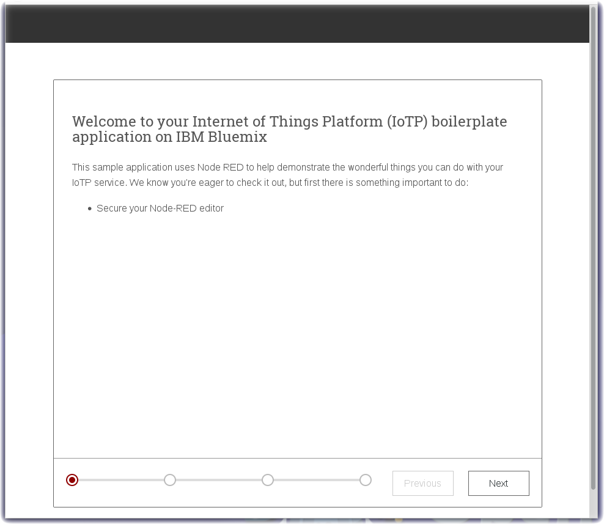
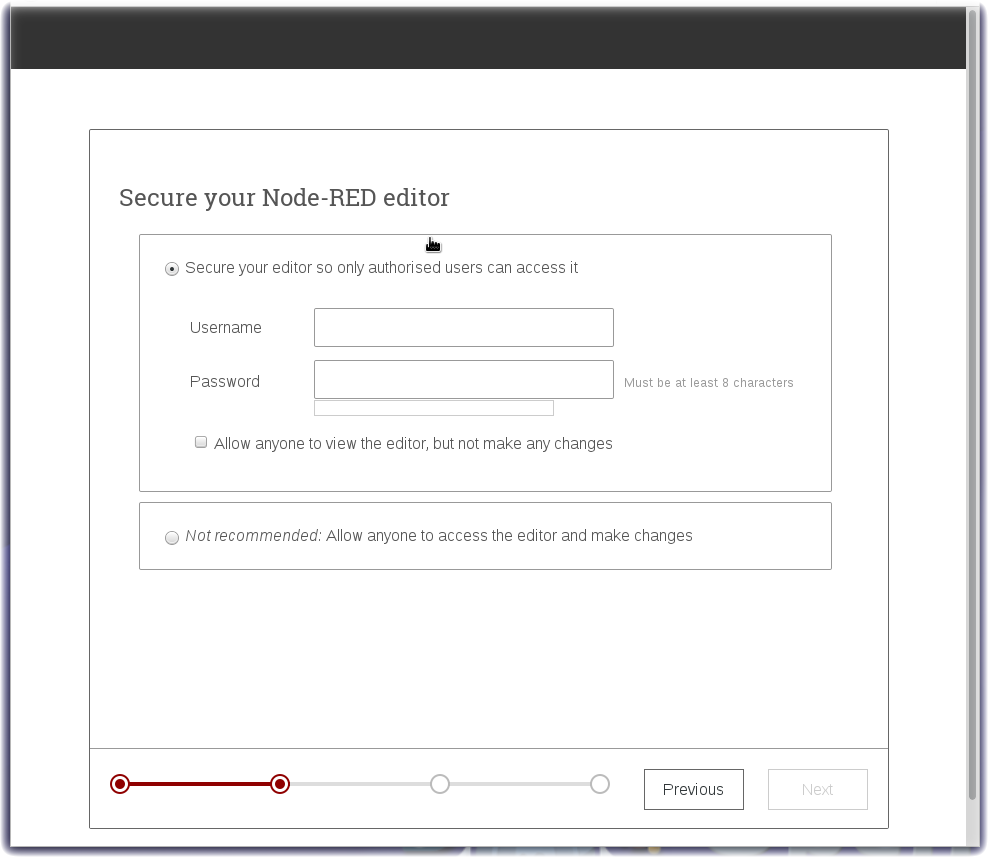
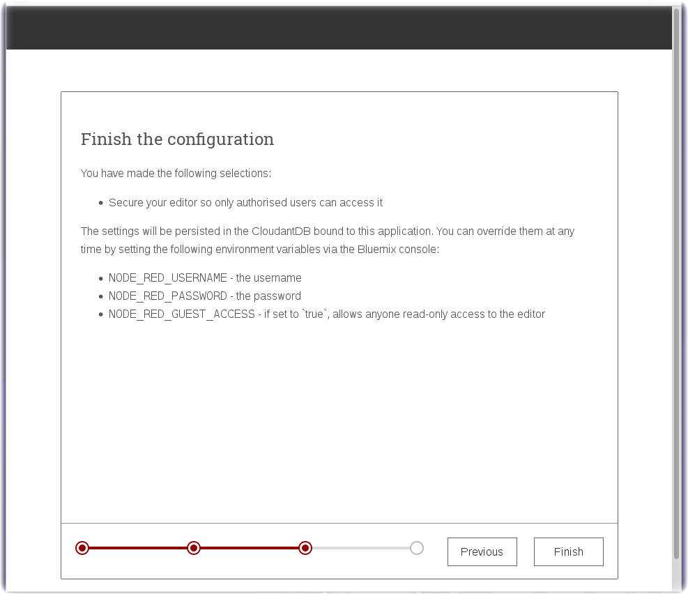
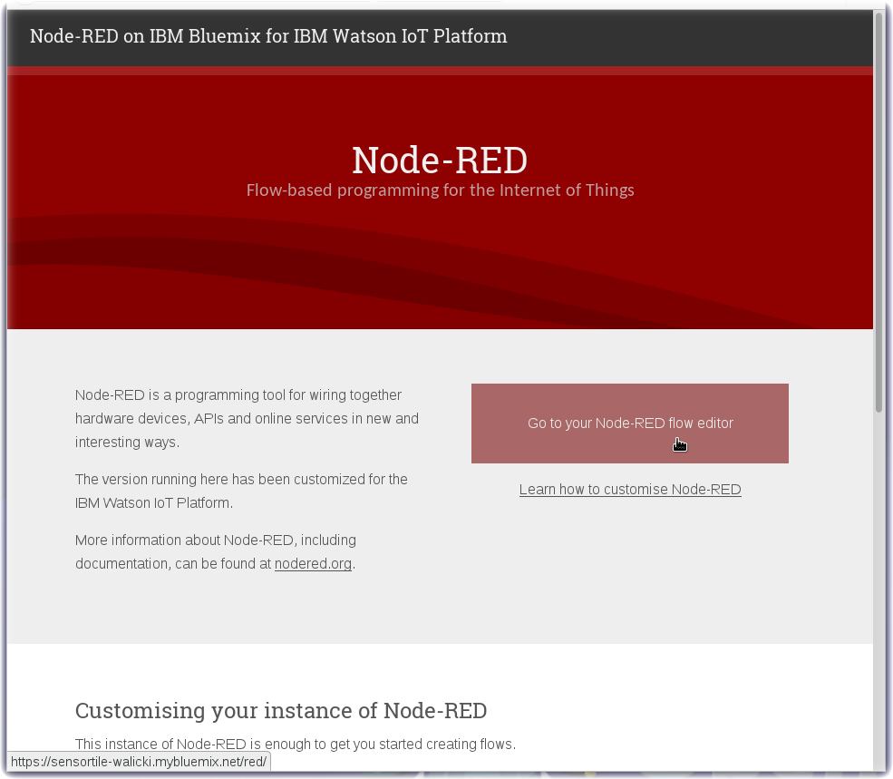
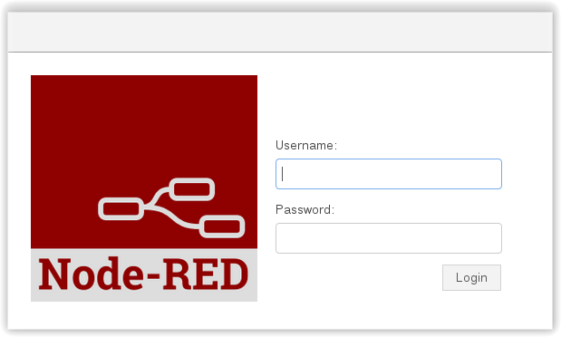
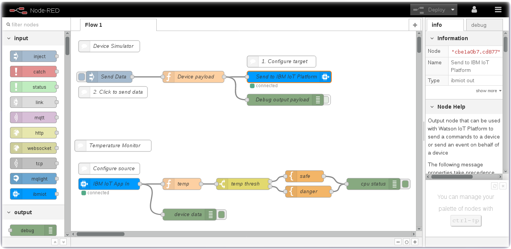

*Quick links :*
[Home](README.md) - [IoT Platform Starter](CREATEIOTP.md) - [Device Types and Devices](DISCOVERYDEVICE.md) - [Node-RED Setup](NODERED.md) - [Sensor Data](DISCOVERYIOTDATA.md) - [Node-RED Charts](DASHBOARD.md) - [Store Data in Cloud Storage](CLOUDANT.md) - [Historical Charts](HISTORY.md) - [Watson Studio](STUDIO.md) - [Jupyter Notebooks](JUPYTER.md)
***

# Node-RED Set up and Configuration in IBM Cloud

## Lab Objectives

In this lab you will set up Node-RED in your Watson IoT Starter application created at the end of Part 2.  You will learn:

- Node-RED Visual Programming
- How to secure your Node-RED Editor in IBM Cloud
- How to install additional Node-RED nodes
- How to import a prebuilt flow from GitHub

### Introduction

Node-RED is an open-source
Node.js application that provides a visual programming editor that makes it easy to wire together flows.

### Step 1 - Node-RED Visual Programming

Recall that in Part 2, you created a IoT Starter Application. Once the Green **Running** icon appears, click the **View App URL** button (6)

### Step 2 - How to secure your Node-RED Editor in IBM Cloud

A new browser tab will open to the Node-RED start page.  Node-RED is an open-source Node.js application that provides a visual programming editor that makes it easy to wire together flows.

Several panels will help you set up Node-RED in your Watson IoT Starter application.

- Welcome to Node-RED and IoT Platform. Click the **Next** button to proceed. Step 1 of 4

- Secure your Node-RED editor by setting a username / password.  Remember your username / password. Click the **Next** button to proceed. Step 2 of 4

- If you forget, you can reset the username / password in the Cloudant DB or by setting IBM Cloud environment variables.  Click the **Finish** button to proceed. Step 3 of 4

- Click the **Go to your Node-RED flow editor** button to launch the Node-RED flow editor. Step 4 of 4

- **Sign in** with your new username and password credentials.

* The **Node-RED Visual Programming Editor** will open with a default flow. On the left side is a **palette of nodes** that you can drag onto the flow. You can **wire nodes together** to create a program.

- The **Node-RED Visual Programming Editor** will open with a default flow.
- On the left side is a **palette of nodes** that you can drag onto the flow.
- You can **wire nodes together** to create a program.
- The sample IoT Starter flow is not applicable to this workshop and can be deleted.

- Click the **+** icon (7) to add a new tab.  Double Click on the **Flow 2** tab header (8).
- Rename this tab from **Flow 2** to Receive Discovery Kit Data (9)

- Double Click on the **Flow 1** tab header (10).  Press the **Delete** button. (11)

### Step 3 - How to install additional Node-RED nodes

- The IoT Starter Application deployed into IBM Cloud includes just a small subset of Node-RED nodes. The Node-RED palette can be extended with over one thousand additional nodes for different devices and functionality. These NPM nodes can be browsed at <http://flows.nodered.org>
- In this Step, you will add the **Node-RED Dashboard** nodes to your Internet of Things Starter Application.
- Click on the Node-RED **Menu** (1) in the upper right corner, then **Manage palette** (2)

- Turn to the **Install** tab (3), type **node-red-dashboard** (4) and press the **Install** button (5).

- Press the **Install** button in the next dialog.

### Step 4 - How to import a prebuilt flow from GitHub

In this step, you will **learn** how to Import a prebuilt flow from GitHub

- Since configuring Node-RED nodes and wiring them together requires many steps to document in screenshots, there is an easier way to build a flow by importing a prebuilt flow into your IoT Starter Application.
- Not here in Step 4, but in several sections below, there will be a **Get the Code** link.
- When instructed in those later sections, open the Get the Code github URL, mark or Ctrl-A to select all of the text, and copy the text for the flow to your Clipboard.
- Click on the Node-RED Menu (6), then Import (7), then Clipboard (8).

- Paste the text of the flow into the **Import nodes** dialog and press the red **Import** button. This is an example of how to paste flows into your Node-RED editor. Don't type the text in the screenshot!

- The new flow will be imported into a new tab in the Node-RED Editor.
- Click the **Deploy** button on the top of menu bar to deploy the Node-RED flow.

### Congratulations - Node-RED is configured
Continue to the next step - [Sensor Data](DISCOVERYIOTDATA.md)

***
*Quick links :*
[Home](README.md) - [IoT Platform Starter](CREATEIOTP.md) - [Device Types and Devices](DISCOVERYDEVICE.md) - [Node-RED Setup](NODERED.md) - [Sensor Data](DISCOVERYIOTDATA.md) - [Node-RED Charts](DASHBOARD.md) - [Store Data in Cloud Storage](CLOUDANT.md) - [Historical Charts](HISTORY.md) - [Watson Studio](STUDIO.md) - [Jupyter Notebooks](JUPYTER.md)
***
